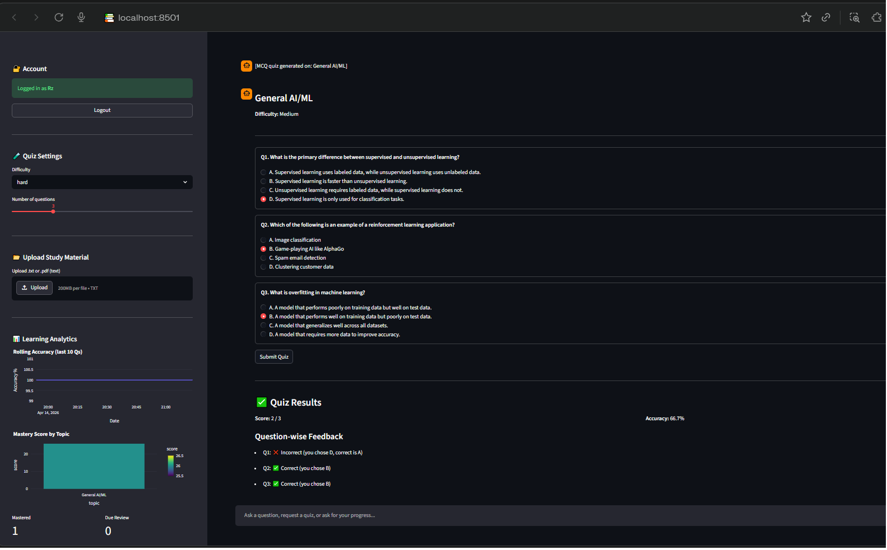

# Personalized AI Learning Coach - Enterprise Edition

> A production-grade, memory-powered AI agent that **adapts to each learner** using LangChain, LangGraph, and Pinecone.


## 🌟 Key Technical Enhancements

This repository has been upgraded from a research-oriented Jupyter Notebook into a modular, production-grade Enterprise AI application.

- **Architectural Shift (MVC Pattern):** Decoupled logic into professional `backend/` and `src/` structures.
- **LangGraph State Machine:** Implemented an Intent Analyzer node for dynamic routing (QA, MCQ, or Analytics).
- **Multi-Tiered Memory:** 
  - **Short-Term:** LangGraph State + Streamlit Session.
  - **Long-Term Semantic:** Pinecone RAG for knowledge retrieval.
  - **Persistent Structured:** SQLAlchemy/SQLite for user history and mastery levels.
- **Full Authentication:** Secure BCrypt password hashing and persistent user sessions.
- **Spaced Repetition (SRS):** Integrated SM-2 model to track "Knowledge Points" and suggest review sessions.
- **Interactive UI:** Dual-purpose Streamlit dashboard with reactive chat and Real-Time Analytics (Pandas/Plotly).

## 🛠️ Project Structure

```text
├── app.py                      # Main Entry point (Streamlit UI)
├── requirements.txt            # All enterprise dependencies
├── .env.example                # Template for API keys
├── backend/
│   ├── auth/                   # Security & User services
│   └── database/               # SQLAlchemy models & session
└── src/
    ├── agent.py                # LangGraph orchestration
    ├── prompts.py              # System & node-specific prompts
    ├── schemas.py              # Pydantic state & data models
    └── memory/                 # SRS, Profile, and Pinecone RAG
```

## 🚀 Setup & Installation

1. **Clone the Repo:**
   ```bash
   git clone https://github.com/RzLetsCode/personalized-learning-coach-memory-agent.git
   cd personalized-learning-coach-memory-agent
   ```

2. **Environment Setup:**
   ```bash
   python -m venv venv
   source venv/bin/activate  # Windows: venv\Scripts\activate
   pip install -r requirements.txt
   ```

3. **Configuration:**
   - Copy `.env.example` to `.env`
   - Add your `OPENAI_API_KEY` and `PINECONE_API_KEY`.

4. **Launch Application:**
   ```bash
   streamlit run app.py
   ```

## 📈 Learning Analytics

The application features a built-in dashboard that visualizes:
- **Mastery Trends:** Progress across different topics.
- **Performance History:** MCQ scores and completion rates.
- **SRS Review Alerts:** Intelligent suggestions for what to study next based on forgetting curves.

## 🖥️ App Screenshots

### Login


### MCQ Quiz


### Quiz Result


## 📄 License

MIT License — feel free to use, adapt, and build on this project.

---
Built by **[RzLetsCode](https://github.com/RzLetsCode)** | [LinkedIn](https://www.linkedin.com/in/rajesh-kumar-04405962/)
